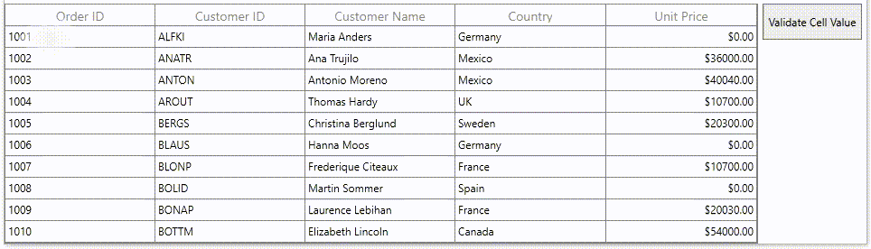

# How to validate all the cell values in WPF DataGrid (SfDataGrid) in button click? 

## About the sample
This example illustrates how to validate all the cell values in WPF DataGrid (SfDataGrid) in button click? 

You can validate the cell value via button click by using [ICommand](https://docs.microsoft.com/en-us/dotnet/api/system.windows.input.icommand) interface and pass the Command parameter element as [SfDataGrid](https://help.syncfusion.com/cr/cref_files/wpf/Syncfusion.SfGrid.WPF~Syncfusion.UI.Xaml.Grid.SfDataGrid.html). Customize the cell validating condition based in CanExecute method.

```XML
<syncfusion:SfDataGrid x:Name="sfDataGrid" 
                               AllowEditing="True"
                               SelectionMode="Single"
                               NavigationMode="Cell"
                               ItemsSource="{Binding Orders}"
                               AutoGenerateColumns="False">
            <syncfusion:SfDataGrid.Columns>
                <syncfusion:GridTextColumn HeaderText="Order ID" MappingName="OrderID"/>
                <syncfusion:GridTextColumn HeaderText="Customer ID" MappingName="CustomerID" />
                <syncfusion:GridTextColumn HeaderText="Customer Name" MappingName="CustomerName" />
                <syncfusion:GridTextColumn HeaderText="Country" MappingName="Country" />
                <syncfusion:GridCurrencyColumn HeaderText="Unit Price" MappingName="UnitPrice"/>
            </syncfusion:SfDataGrid.Columns>
</syncfusion:SfDataGrid>

<StackPanel Grid.Column="1">
            <Button  Content="Validate Cell Value"  Width="100" Height="50"
                     Command="{Binding Path=DataContext.RowDataCommand,ElementName=sfDataGrid}" 
                     CommandParameter="{Binding ElementName=sfDataGrid}"/>
</StackPanel>

```

```C#
public void ChangeCanExecute(object obj)
{
    var datagrid = (obj as SfDataGrid);
    //Here customize condition based cell validation 
    foreach (var record in datagrid.View.Records)
    {
        if ((record.Data as OrderInfo).UnitPrice == 0)
        {
            MessageBox.Show("Invalid value in OrderID: " + (record.Data as OrderInfo).OrderID);

            Setter setter = new Setter();
            setter.Property = GridCell.BackgroundProperty;
            setter.Value = Brushes.Red;
            var style = new Style(typeof(GridCell));

            DataTrigger dataTrigger = new DataTrigger();
            dataTrigger.Binding = new Binding("UnitPrice");
            dataTrigger.Value = (double?)000;
            dataTrigger.Setters.Add(setter);

            style.Triggers.Add(dataTrigger);
            datagrid.Columns["UnitPrice"].CellStyle = style;
        }
    }
}

```



## Requirements to run the demo
Visual Studio 2015 and above versions

